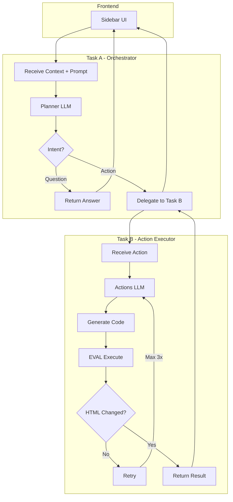
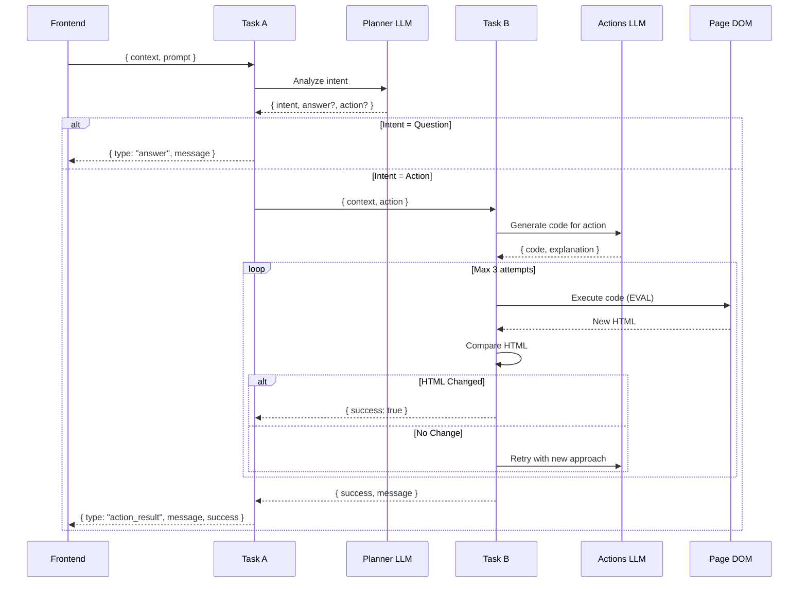
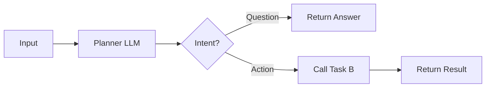
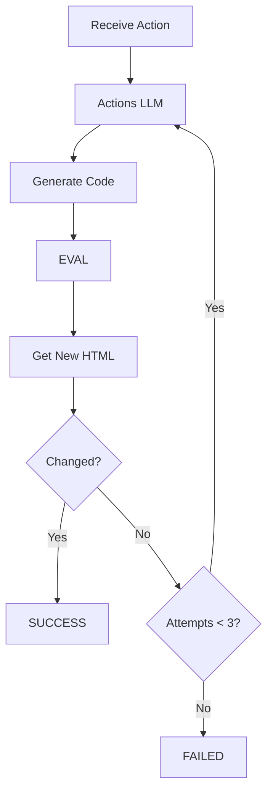
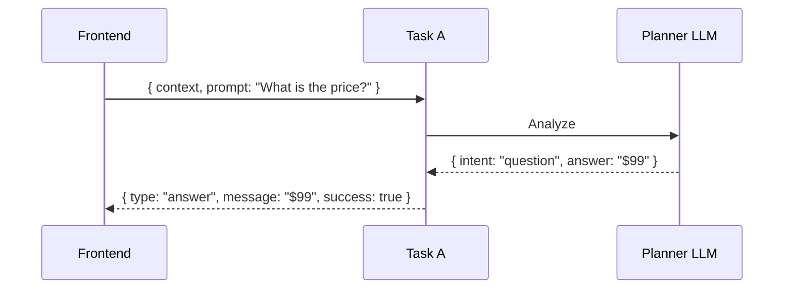
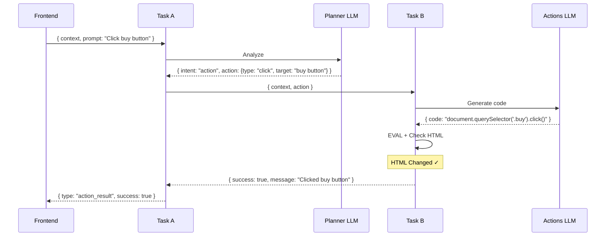
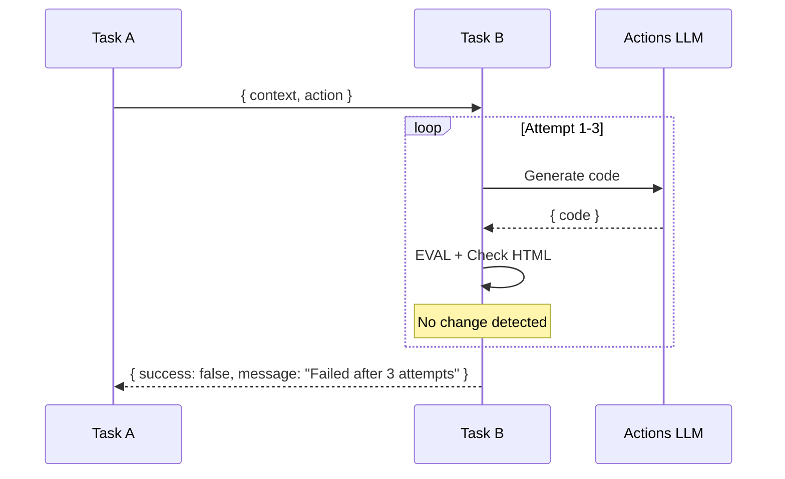
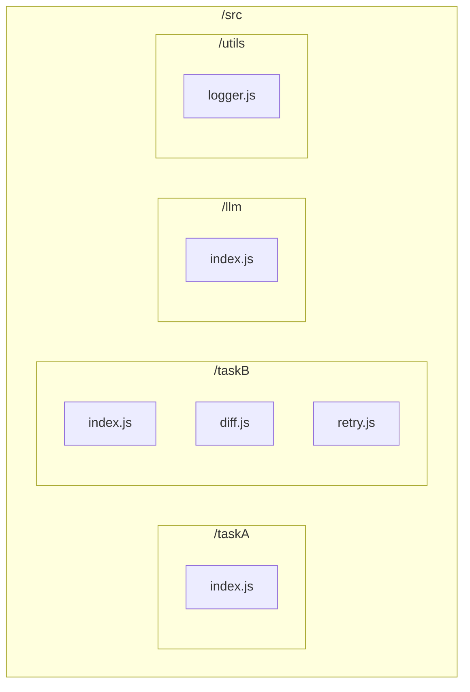

# AI Browser Extension Backend - Project Specification

## 📋 Project Overview

### Purpose
Build the **backend logic** for a browser extension that provides an AI-powered chat sidebar. The sidebar can:
- See and understand the current page context (HTML + CSS)
- Answer user questions about the page content
- Perform automated actions on behalf of the user (click buttons, fill forms, scroll, etc.)

### Technology Stack
- **Language:** JavaScript ES6
- **Runtime:** Browser Extension Environment
- **LLM Integration:** External AI model API calls (planner model + actions model)

---

## 🏗️ System Architecture



---

## 🔄 Sequence Diagram - Full Flow



---

## 📦 TASK A - ORCHESTRATOR MODULE

### Responsibilities
1. Receive context (HTML + CSS) and user prompt from frontend
2. Send to Planner LLM
3. If question → return answer to frontend
4. If action needed → delegate to Task B



### Interfaces

```javascript
// INPUT: What Task A receives from frontend
{
  context: string,    // HTML + CSS combined
  prompt: string      // User's question or request
}

// OUTPUT: What Task A returns to frontend
{
  type: string,       // "answer" | "action_result"
  message: string,    // Response text for the user
  success: boolean    // Did it work?
}
```

### Planner LLM Response Format

```javascript
// What the Planner LLM should return
{
  intent: string,     // "question" | "action"
  answer: string,     // If question: the answer text
  action: {           // If action: what to do
    type: string,     // "click" | "fill" | "scroll" | "select" | etc.
    target: string,   // Description of element (e.g., "the blue submit button")
    value: string     // Optional: value for fill/select actions
  }
}
```

### Task A Functions

```javascript
/**
 * Main entry point
 * @param {string} context - HTML + CSS content
 * @param {string} prompt - User's request
 * @returns {Promise<{type, message, success}>}
 */
async function processRequest(context, prompt) {}

/**
 * Call Planner LLM
 * @param {string} context - Page context
 * @param {string} prompt - User prompt
 * @returns {Promise<{intent, answer?, action?}>}
 */
async function callPlannerLLM(context, prompt) {}

/**
 * Delegate action to Task B
 * @param {string} context - Page context
 * @param {{type, target, value?}} action - Action to perform
 * @returns {Promise<{success, message}>}
 */
async function delegateToTaskB(context, action) {}
```

---

## ⚡ TASK B - ACTION EXECUTOR MODULE

### Responsibilities
1. Receive context and action from Task A
2. Call Actions LLM to generate JavaScript code
3. Execute code with EVAL
4. Check if HTML changed
5. Retry up to 3 times if no change
6. Return SUCCESS or FAILED to Task A



### Interfaces

```javascript
// INPUT: What Task B receives from Task A
{
  context: string,    // Current HTML + CSS
  action: {
    type: string,     // "click" | "fill" | "scroll" | etc.
    target: string,   // Element description
    value: string     // Optional value
  }
}

// OUTPUT: What Task B returns to Task A
{
  success: boolean,   // true = SUCCESS, false = FAILED
  message: string     // Description of what happened
}
```

### Actions LLM Response Format

```javascript
// What the Actions LLM should return
{
  code: string,       // Executable JavaScript code
  explanation: string // What the code does
}
```

### Task B Functions

```javascript
/**
 * Main entry point
 * @param {string} context - HTML + CSS content
 * @param {{type, target, value?}} action - Action to perform
 * @returns {Promise<{success, message}>}
 */
async function executeAction(context, action) {}

/**
 * Call Actions LLM to generate code
 * @param {string} context - Page context
 * @param {{type, target, value?}} action - Action descriptor
 * @returns {Promise<{code, explanation}>}
 */
async function callActionsLLM(context, action) {}

/**
 * Execute generated code
 * @param {string} code - JavaScript to execute
 * @returns {Promise<{success, error?}>}
 */
async function runCode(code) {}

/**
 * Get current page HTML
 * @returns {string}
 */
function getHTML() {}

/**
 * Check if HTML changed
 * @param {string} before - HTML before action
 * @param {string} after - HTML after action
 * @returns {boolean}
 */
function hasChanged(before, after) {}

/**
 * Execute with retry logic (max 3 attempts)
 * @param {string} context - Page context
 * @param {{type, target, value?}} action - Action to perform
 * @returns {Promise<{success, message}>}
 */
async function executeWithRetry(context, action) {}
```

---

## 🔄 Data Flow Examples

### Question Flow



### Action Flow (Success on First Try)



### Action Flow (Retry then Fail)



---

## 📝 Supported Actions

| Type | Description | Needs Value? |
|------|-------------|--------------|
| `click` | Click element | No |
| `fill` | Fill input field | Yes |
| `select` | Select dropdown option | Yes |
| `scroll` | Scroll page (up/down/top/bottom) | Yes (direction) |
| `check` | Toggle checkbox | No |
| `hover` | Hover over element | No |
| `submit` | Submit form | No |

---

## 🛡️ Error Handling

```javascript
// Simple error codes
const Errors = {
  LLM_FAILED: 'LLM call failed',
  CODE_FAILED: 'Code execution failed',
  MAX_RETRIES: 'Max retries exceeded',
  INVALID_ACTION: 'Invalid action type'
};
```

---

## 📁 File Structure



```
/src
  /taskA
    index.js          # processRequest, callPlannerLLM, delegateToTaskB
  /taskB
    index.js          # executeAction, callActionsLLM, runCode
    diff.js           # hasChanged
    retry.js          # executeWithRetry
  /llm
    index.js          # Generic LLM call wrapper
  /utils
    logger.js         # Simple logging
```

---

## ✅ Acceptance Criteria

### Task A
- [ ] Receives context + prompt
- [ ] Calls Planner LLM
- [ ] Returns answer for questions
- [ ] Delegates actions to Task B
- [ ] Returns final result to frontend

### Task B
- [ ] Receives context + action
- [ ] Calls Actions LLM for code
- [ ] Executes code with EVAL
- [ ] Detects HTML changes
- [ ] Retries up to 3 times
- [ ] Returns SUCCESS or FAILED

---

## 🚀 Implementation Order



```mermaid
gantt
    title Implementation Timeline
    dateFormat  X
    axisFormat %s
    
    section Phase 1
    LLM Wrapper           :a1, 0, 1
    
    section Phase 2
    Task A - Planner      :a2, 1, 2
    
    section Phase 3
    Task B - Executor     :a3, 2, 4
    Task B - Diff         :a4, 2, 3
    Task B - Retry        :a5, 3, 4
    
    section Phase 4
    Integration           :a6, 4, 5
    Testing               :a7, 5, 6
```

1. **LLM wrapper** - Generic function to call LLM APIs
2. **Task A** - Planner logic and routing
3. **Task B** - Code generation, execution, diff, retry
4. **Integration** - Connect Task A ↔ Task B
5. **Testing** - End-to-end flows